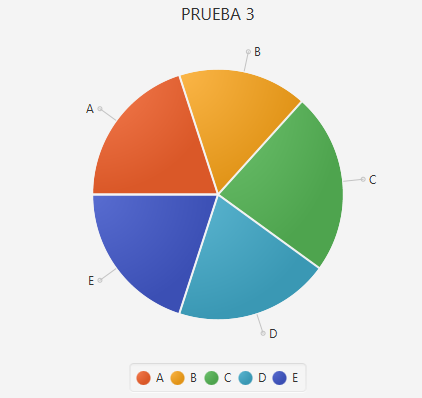
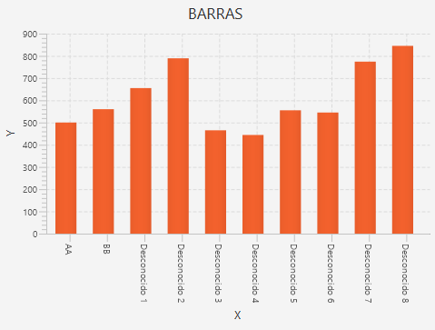

# GRAFICAS

## Graficas1.r

**Entrada:**

```r
pie(c(6, 5, 7, 6, 6), c("A", "B", "C", "D", "E"), c("PRUEBA 3"));

barplot(c(500, 560, 655, 789, 465, 444, 555, 545, 774, 845), "X", "Y", "BARRAS", c("AA", "BB"));


Vector1 = c(c(4,5), list(list(list(list(7,8),8),8),8));

print(Vector1);

```

**Salida:**





```bash
> { [ 4 ], [ 5 ], { { { [ 7 ], [ 8 ] }, [ 8 ] }, [ 8 ] }, [ 8 ] }
```